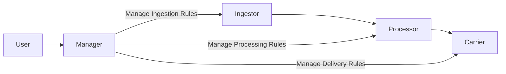

# reactive-app-modernization-with-scala

## Project: Storm Shadow

The business people have just decided, without talking to tech at all 🤮, that they want to ship their product in the
next
10 hours - we only have 2 tech guys around, and we don't want to get fired, so we need to get this done real quick. We
will deliver this with [Nothing But Logic](https://www.kalix.io/) and remove all complexities of the back end by
inferring all infrastructure needs from our code.

Remember - We have to focus solely on the business logic of this extremely crude architecture they have provided us
with.

## Architecture

> Seminar conducted for the graduating class of 2023[MCA] at Guru Gobind Singh Indraprastha University, New Delhi
